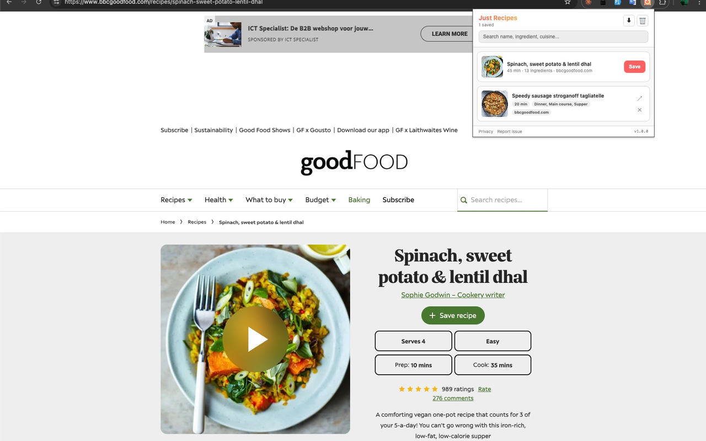

# Just Recipes

Clip recipe pages into a clean, ad-free reader. 100% local, no tracking.

## What it does

Visit a recipe page on any site that ships `@type: "Recipe"` JSON-LD (most major food blogs do), click the Just Recipes icon, and hit **Save**. The extension pulls out just the name, ingredients, instructions, and times — dropping the ads, the life story, the newsletter popup, the "my grandmother first told me about this dish in 1987..." paragraphs.

Open any saved recipe → it renders in a clean serif reader with ingredients and numbered instructions. Print-friendly CSS built in.

Works out of the box on BBC Good Food, AllRecipes, NYT Cooking, Bon Appétit, Serious Eats, Food Network, and thousands of other sites that implement schema.org structured data.

## Features

- One-click save from any recipe page with JSON-LD
- Flattens `HowToSection`/`HowToStep` nested instructions into a single numbered list
- ISO 8601 duration parsing (`PT1H30M` → 90 minutes)
- Clean reader with serif typography, print-friendly
- Search by name, ingredient, cuisine, category, author, keyword
- JSON export of your full recipe library
- 100% local — no account, no server, no network requests from the extension

## Privacy

No data leaves your device. Ever. The extension does not make any outbound network requests. See [privacy-policy.md](./privacy-policy.md) for details.

## Install

Until the extension is live on the Chrome Web Store, load it manually:

1. Clone or download this repo
2. Open `chrome://extensions`
3. Enable "Developer mode"
4. Click "Load unpacked" → select this folder

## How it works

- When you open the popup on a recipe page, `src/popup.js` injects a tiny data-extraction function into the current tab via `chrome.scripting` (using `activeTab`, which does not require host permissions). The function returns the raw HTML.
- The parser in `src/lib/parser.js` scans all `<script type="application/ld+json">` blocks, traverses any `@graph` arrays, finds the first `@type: "Recipe"` object, and normalizes it into a flat shape.
- Clicking **Save** computes a SHA-1 of the canonical source URL as a stable id and writes the recipe to `chrome.storage.local`.
- Clicking a saved card opens `src/viewer.html?id=<recipeId>` — a standalone reader page that reads from storage and renders ingredients + numbered instructions in a clean serif layout.

No bundler, no runtime dependencies. Plain JS. MV3. `npm test` runs Node's built-in test runner (22 tests covering parser + ISO duration).

## Contributing

Issues and PRs welcome.

## License

MIT — see [LICENSE](./LICENSE).
